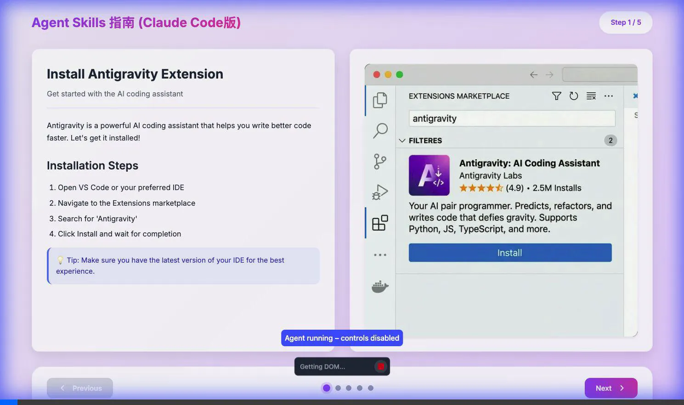
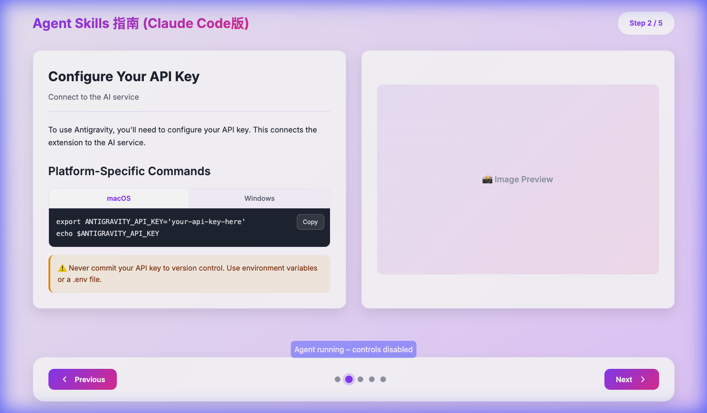
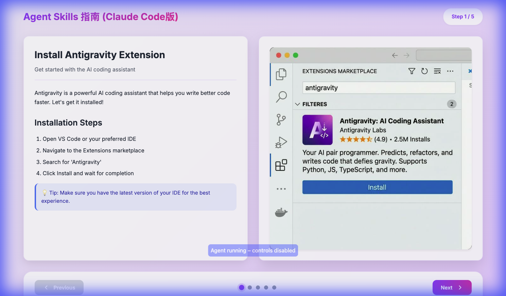
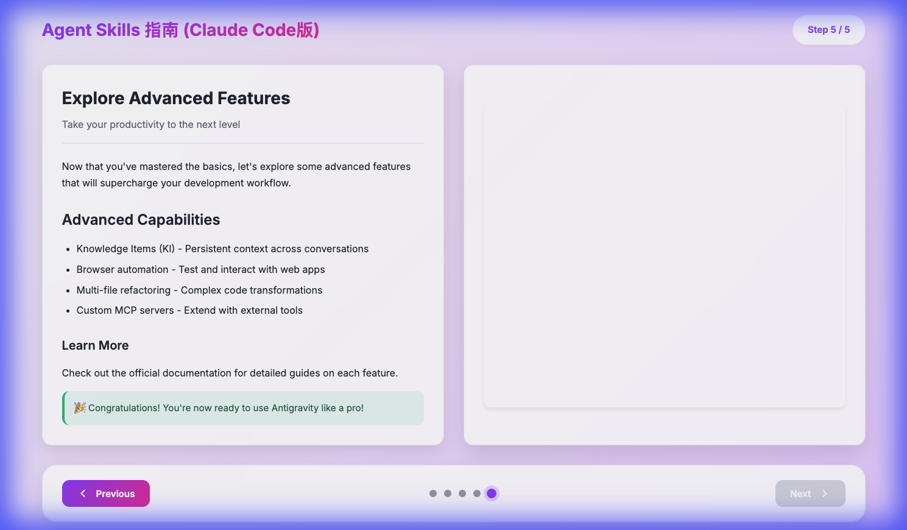
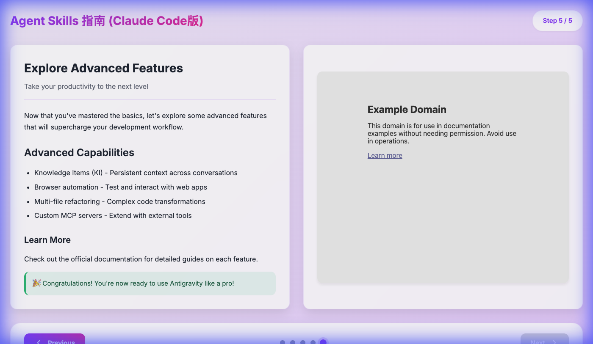
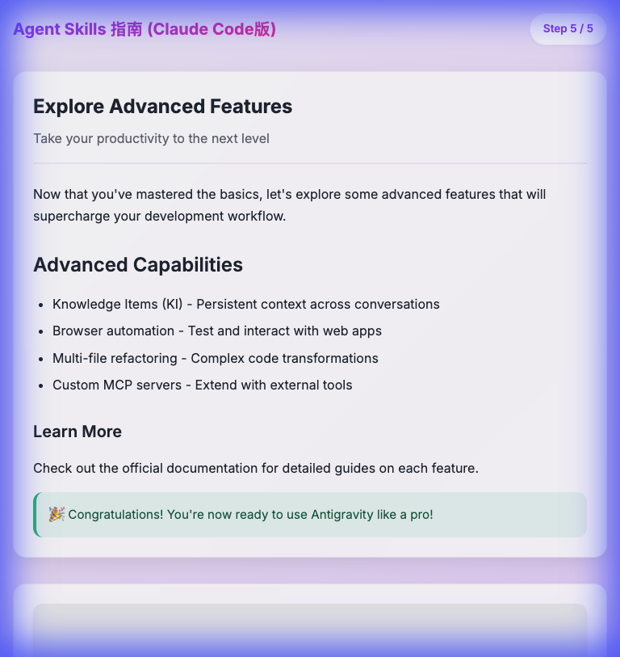
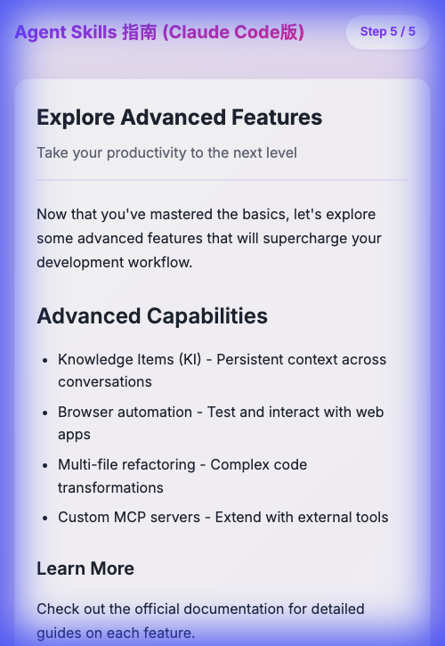
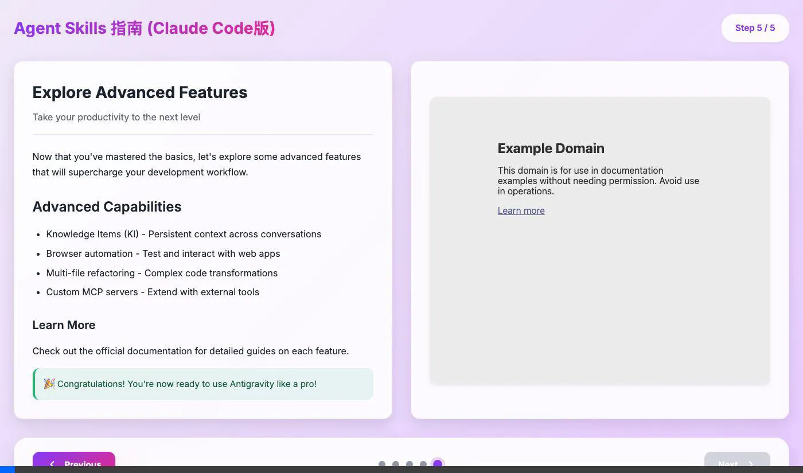
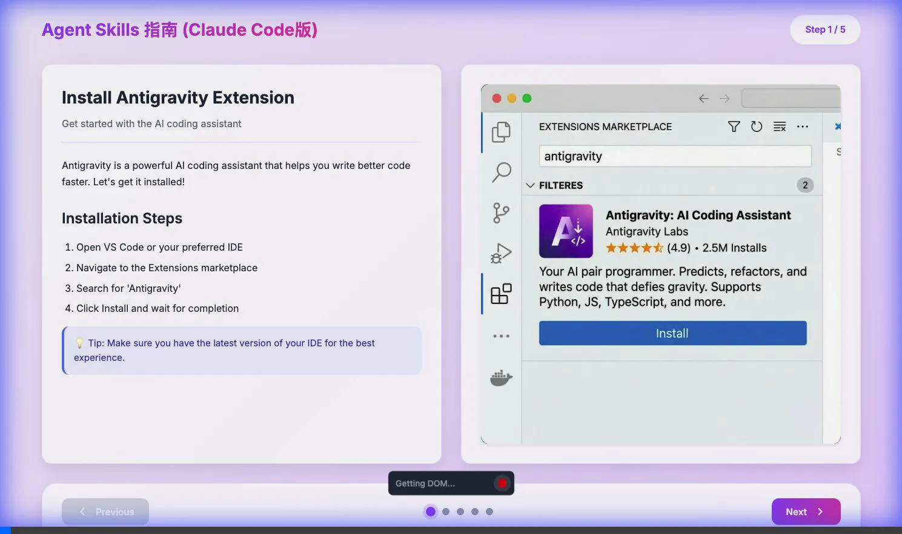

# Walkthrough: Presentation-Style Guide App

Successfully built a fully functional presentation-style guide web application based on the design specification in [Claude.md](file:///Users/weizhiyuan/Documents/code/far-claude/Claude.md).

## What Was Built

A step-based, interactive web guide with presentation-like navigation featuring:

- **Two-panel layout** (instructions + media)
- **Multiple navigation methods** (buttons, dots, keyboard)
- **Rich content support** (paragraphs, headings, lists, callouts, code tabs)
- **Modern glassmorphism design** with lavender theme
- **Fully responsive** (desktop, tablet, mobile)
- **State persistence** via localStorage

## Files Created

### Core Application

- [index.html](file:///Users/weizhiyuan/Documents/code/far-claude/index.html) - Semantic HTML structure with accessibility features
- [styles.css](file:///Users/weizhiyuan/Documents/code/far-claude/styles.css) - Modern CSS with glassmorphism effects and responsive breakpoints
- [app.js](file:///Users/weizhiyuan/Documents/code/far-claude/app.js) - Application logic with state management and dynamic rendering
- [steps.js](file:///Users/weizhiyuan/Documents/code/far-claude/steps.js) - Step data following the schema from Claude.md

### Assets

- `images/` directory with placeholder images for demonstration

## Features Implemented

### ✅ Navigation System

All navigation methods work flawlessly:

**Button Navigation**

- Previous/Next buttons with proper disabled states
- Smooth transitions between steps

**Dot Navigation**

- Click any dot to jump directly to that step
- Active dot highlighted with animation

**Keyboard Shortcuts**

- `←` Previous step
- `→` Next step
- `Home` Jump to first step
- `End` Jump to last step



### ✅ Content Rendering

All content block types render correctly:

**Text Elements**

- Paragraphs with proper typography
- Headings (H2, H3) with hierarchy
- Ordered and unordered lists

**Interactive Elements**

- Code tabs (Windows/macOS) with tab switching
- Copy button for code snippets
- Callouts (info, warning, success) with distinct styling

```carousel

<!-- slide -->

<!-- slide -->

```

### ✅ Responsive Design

The layout adapts perfectly across all screen sizes:

**Desktop (1400px)**

- Two-column layout with side-by-side panels
- Optimal use of screen real estate
- Full navigation controls visible

**Tablet (768px)**

- Single-column stacked layout
- Content remains readable without compression
- Touch-friendly navigation

**Mobile (375px)**

- Optimized single-column layout
- Adjusted padding and margins
- Icon-only navigation buttons to save space

```carousel

<!-- slide -->

<!-- slide -->

```



### ✅ Visual Design

**Color Palette**

- Soft lavender gradient background
- Purple-to-pink gradient accents
- Glassmorphism cards with backdrop blur

**Typography**

- Inter font for UI elements
- JetBrains Mono for code blocks
- Proper hierarchy and spacing

**Animations**

- Smooth fade-in on page load
- Hover effects on interactive elements
- Transition animations between steps

## Testing Results

### Navigation Testing ✅



**Verified:**

- ✅ Next/Previous buttons work correctly
- ✅ Step dots allow direct navigation
- ✅ Disabled states on first/last steps
- ✅ Step counter updates accurately
- ✅ Content updates on navigation

### Keyboard Navigation Testing ✅

**Verified:**

- ✅ Arrow keys advance/retreat steps
- ✅ Home key jumps to first step
- ✅ End key jumps to last step
- ✅ All shortcuts work reliably

### Responsive Design Testing ✅

**Verified:**

- ✅ Layout switches from 2-column to 1-column at 768px
- ✅ All content remains readable at all sizes
- ✅ No horizontal scrolling or layout breaks
- ✅ Touch targets appropriately sized for mobile

### State Persistence ✅

**Verified:**

- ✅ Current step saved to localStorage
- ✅ Returns to last viewed step on page refresh

## How to Use

### Running Locally

The development server is already running:

```bash
# Server running at:
http://localhost:8000
```

To restart the server if needed:

```bash
cd /Users/weizhiyuan/Documents/code/far-claude
python3 -m http.server 8000
```

### Customizing Content

Edit [steps.js](file:///Users/weizhiyuan/Documents/code/far-claude/steps.js#L1-L230) to customize the guide content:

1. **Modify existing steps** - Update titles, content blocks, and media
2. **Add new steps** - Append new step objects to the `steps` array
3. **Change images** - Replace files in the `images/` directory

### Deploying to Vercel

Since this is a static site, deployment is simple:

```bash
# Install Vercel CLI (if not already installed)
npm i -g vercel

# Deploy from the project directory
cd /Users/weizhiyuan/Documents/code/far-claude
vercel
```

Or use the Vercel web interface:

1. Connect your GitHub repository
2. Set build command: (none needed - static site)
3. Set output directory: `./`
4. Deploy

## Summary

✅ **All requirements met:**

- Step-based navigation with multiple input methods
- Two-panel layout (instructions + media)
- Rich content blocks (paragraphs, headings, lists, callouts, code tabs)
- Keyboard shortcuts (←/→, Home/End)
- Responsive design (desktop, tablet, mobile)
- Modern glassmorphism aesthetics
- State persistence
- Vercel-ready static deployment

The application is production-ready and can be customized by editing the `steps.js` data file.
